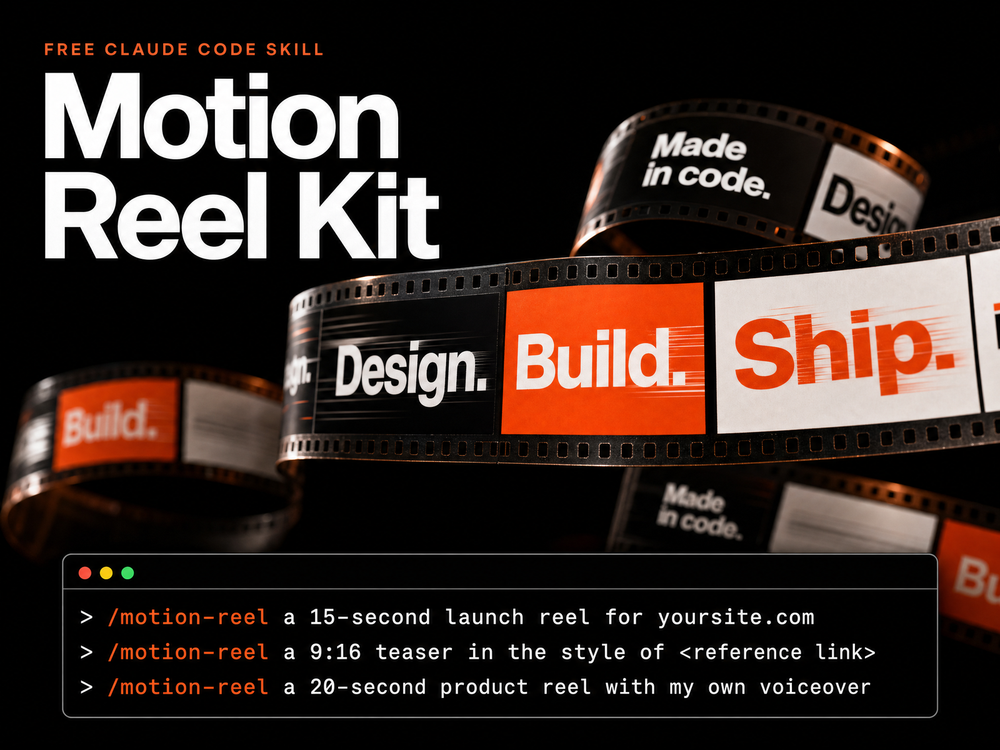

# Motion Reel Kit

Beat-synced motion graphics made entirely in code, directed by Claude Code.

You describe the product. Claude captures the real brand from its site, writes a style guide and a shotlist, and waits for your OK. Then it builds the film as a pure function of time, with springs, a synthesized score and UI sounds on the measured beat grid. It critiques its own render until every score is 8 or higher, and exports H.264 in 16:9, 1:1, 4:5 and 9:16.

## What's inside

| | |
|---|---|
| `CLAUDE.md` | The motion rules: `seek(t)`, seeded noise only, no timers or CSS transitions in render mode, springs only, the banned-cliché list. |
| `.claude/skills/motion-reel/` (hidden folder) | The `/motion-reel` skill: `SKILL.md`, the engine (`engine/index.html`, `core.js`, `type.js`, `lib/motion.js`), the pipeline scripts (`render.mjs`, `beats.py`, `sfx.mjs`, `music.py`, `mix.py`, `sync.mjs`, `capture.mjs`, `vo.py`, `review.py`, `preset.mjs`), the critique prompt (`reference/CRITIQUE.md`) and templates. |
| `presets/lukas-yt/` | A worked example preset: brand, colours, Geist font, 120 BPM, 16:9 + 9:16, own-voice narration, house notes. |
| `presets/blank/` | The same fields, empty, with a comment on every one. Copy it for your brand. |
| `prompts/` | Every chapter prompt in order (`01` to `14`), the director's brief as a fill-in-the-blanks template, and the critique scorecard. |
| `examples/` | A 5-second test render made by this kit with the blank preset. |
| `cover.png` | The kit cover (1600×1200, 4:3). |
| `Makefile` | `make install` detects your OS (Windows, macOS or Linux) and runs the matching installer. Also `make test` and `make uninstall`. |
| `install/` | `install.sh` (macOS/Linux), `install.ps1` (Windows) and `test-render.mjs` (cross-platform smoke test). |

## Quick start

**1. Install Node 22+, ffmpeg and Python 3.9+**

| OS | Command |
|---|---|
| macOS | `brew install node ffmpeg python` |
| Windows | `winget install OpenJS.NodeJS.LTS Gyan.FFmpeg Python.Python.3.12` (then open a new terminal) |
| Debian/Ubuntu | `sudo apt install nodejs npm ffmpeg python3 python3-pip` |

On Linux the distro's `nodejs` is often older than 22: use [nodejs.org](https://nodejs.org), nvm or fnm for a current one. Chromium also needs system libraries on Linux; if the installer says it doesn't launch, run `sudo npx playwright install-deps chromium` inside `~/.claude/skills/motion-reel`.

**2. Run the installer** from inside this folder
```bash
make install
```
`make` detects your OS and runs `install/install.sh` (macOS/Linux) or `install/install.ps1` (Windows). No `make`? Run the script for your OS directly:

```bash
sh install/install.sh                                                  # macOS / Linux
```
```powershell
powershell -ExecutionPolicy Bypass -File install\install.ps1           # Windows
```

It installs the skill for your user (`~/.claude/skills/motion-reel`), so `/motion-reel` works in **every** project. It also installs the presets, Playwright + Chromium and the Python audio libraries. To install into one project only: `make install PROJECT=/path/to/project` (or `sh install/install.sh --project <dir>` / `install.ps1 -Project <dir>`).

On Windows, `make` is not preinstalled: `winget install ezwinports.make`. The installer also works when `node` is only available through `fnm`, and it skips the Microsoft Store `python3` stub.

**3. Start a new Claude Code session and type `/motion-reel`** in any project. Skills load when a session starts, so open a new one after installing. Claude asks for anything that's missing in one round.

Optional: copy this kit's `CLAUDE.md` into a project's root so the motion rules apply to everything you make there. The skill applies them anyway.

## Example command

```text
/motion-reel 20-second launch reel for https://example.com in 16:9 and 9:16. Use presets/blank, synthesize the music, no voiceover.
```

## Get started prompts

Swap in your own site. Claude asks for anything missing in one round, then shows you a shotlist before it builds anything.

```text
/motion-reel a 15-second launch reel for https://yoursite.com
```
```text
/motion-reel a 9:16 teaser for https://yoursite.com in the style of <link to a launch video you love>. Take its rhythm and transitions, not its content.
```
```text
/motion-reel a 20-second product reel for https://yoursite.com with a voiceover in my own Fish Audio voice. Natural sentences only; never read the on-screen captions aloud.
```
```text
/motion-reel fill in presets/blank from https://yoursite.com (colours, fonts, promise, CTA), save it as presets/<my-brand>, then make a 15-second reel with it.
```
```text
/motion-reel critique the last render: contact sheet, phone test at 360 px, loop seam. Fix the 3 worst problems and repeat until every score is 8+.
```

To check your setup before the first real film, render the 5-second test:
```bash
make test        # or: npm test
```
It writes `videos/_test-<time>/renders/16x9.mp4`. To test a preset of your own: `node install/test-render.mjs presets/<your-brand> 5`.

## Make your own preset

1. Copy `presets/blank` to `presets/<your-brand>`.
2. Fill in `preset.jsonc`: product, URL, hook, CTA, colours, fonts (`.woff2` files you're allowed to redistribute), tempo, formats and voiceover.
3. Say "use presets/<your-brand>" when you run `/motion-reel`. The preset fills the brief, colour tokens, fonts and timeline, so Claude only asks about what's left.

## How a film gets made

1. **Intake:** brief, preset, missing inputs asked in one round.
2. **Assets:** real screenshots, logo, fonts and colours from the product URL (Playwright).
3. **Style guide:** palette, type and rhythm. From a reference film it takes the grammar, never the content.
4. **Beat grid:** original score synthesized in code, measured with librosa into `beats.json`.
5. **Shotlist:** then it **stops for your OK**.
6. **Build:** `window.seek(t)` scenes with closed-form springs, hits led to read on the beat.
7. **Critique loop:** contact sheets, fast-action strips, phone test at 360 px, loop seam. A fresh critic scores 8 criteria, and it fixes the 3 worst problems each round. At least 3 rounds, until every score is 8+.
8. **Finals:** 60 fps with motion blur, SFX, a -14 LUFS mix, every format.

Optional voiceover uses the Fish Audio MCP. Connect it in Claude Code first, and use your own cloned voice if you have one.

## Troubleshooting

**`/motion-reel` doesn't show up.** Run `make install`, then start a **new** Claude Code session. Check the skill is there: `ls ~/.claude/skills/motion-reel/SKILL.md` (Windows: `dir $HOME\.claude\skills\motion-reel\SKILL.md`). If you copied the kit by hand, you probably missed the hidden `.claude` folder (Finder: **Cmd + Shift + .** shows it). The installer avoids this.

**"playwright not found" when rendering.** Re-run `make install`. New films get Playwright from the skill install automatically. For an older film folder, run `npm i -D playwright` inside it.

**pip refuses to install the Python libraries** ("externally-managed-environment", common with Homebrew Python). Use the Python that ships with macOS, which allows user installs:
```bash
/usr/bin/python3 -m pip install --user -r requirements.txt
```
Or, if you want to keep Homebrew Python: `python3 -m pip install --user --break-system-packages -r requirements.txt`.

**Windows: `python3` opens the Microsoft Store, or `node` is "not recognized".** The `python3` entry is a Store stub; use `python` (the installer tests each candidate and skips the stub). If Node comes from fnm, load it in the shell first: `fnm env --use-on-cd --shell power-shell | Out-String | Invoke-Expression`. The film commands in the skill are plain `node …` / `python …`, so no `sh` is needed on Windows. On macOS/Linux read `python` as `python3`.

**Re-installing.** The installer moves the old install to `~/.claude/skills-backup/` (outside `skills/`, so it never loads as a duplicate skill). Delete that folder when you no longer need it.

**Using presets.** Say "use preset blank" (or `lukas-yt`, or your own). Claude looks in your project's `presets/` folder first, then in the installed skill's `presets/`. To add your own for every project, copy `presets/blank` to `~/.claude/skills/motion-reel/presets/<your-brand>` and fill it in.

## Requirements

- Node 22+, ffmpeg, Playwright Chromium
- Python 3.9+ with numpy, scipy, soundfile, librosa and pillow (`requirements.txt`)
- Claude Code
- Windows 10/11, macOS or Linux. `make` is optional.

The Geist font in `presets/lukas-yt/fonts` is under the SIL Open Font License (`OFL-Geist.txt`).

## Credits

Created and maintained by **Arpan Kumar** · [arpankumar1119@gmail.com](mailto:arpankumar1119@gmail.com) · [GitHub: thearpankumar](https://github.com/thearpankumar)
